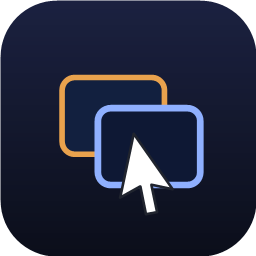

<p align="center">
  
</p>

<h1 align="center">Snapfield</h1>

Windows 전용 멀티-PC / 멀티-모니터 커서·키보드 공유 툴.
**Mouse Without Borders**(네트워크 너머 PC 공유)와 **LittleBigMouse**(물리 좌표 기반 정밀 배치)를 결합한다.

## 핵심 아이디어

모든 PC의 모든 모니터를 **하나의 전역 물리 좌표 평면(mm 단위)** 에 배치한다.
커서가 어느 화면 경계를 넘든, 그 위치를 전역 mm로 환산 → 이웃 모니터(같은 PC든 다른 PC든)를
찾아 → 그 PC의 픽셀 좌표로 되돌려 커서를 놓는다. 해상도·물리 크기·DPI·상하 오프셋이 서로 달라도
커서가 **물리적으로 같은 높이**에서 자연스럽게 넘어간다 (MWB의 Y좌표 튐 문제 해결).

## 구조

```
Snapfield.sln
├─ src/
│  ├─ Snapfield.Core/        좌표계 모델 + 3단계 변환 파이프라인 (순수 C#, DI 없음)
│  │   ├─ Geometry/          PhysicalPoint/Rect (mm), PixelRect (물리 픽셀)
│  │   ├─ Model/             MonitorInfo, DesktopLayout (전역 평면)
│  │   └─ Transforms/        CoordinateMapper — pixel↔physical, hit-test, resolve
│  ├─ Snapfield.Platform/    Win32 P/Invoke + WMI (net8.0-windows)
│  │   ├─ Interop/           NativeMethods (DPI, EnumDisplayMonitors, EnumDisplayDevices)
│  │   └─ Monitors/          MonitorEnumerator — 실물 열거 + EDID 물리 크기
│  └─ Snapfield.App/         WPF 앱 — 한 창 3탭(연결 · 모니터 배치 · 설정), 트레이 상주
├─ android/                  안드로이드 수신 앱 — 폰/태블릿을 평면 위 모니터처럼 (커서·한글 키보드·양방향 클립보드)
└─ tests/
   └─ Snapfield.Core.Tests/  단위 테스트 56개 (좌표 변환 · 커서 라우터 · 경계 스캔 · 레이아웃 병합 · 와이어 프로토콜)
```

## 좌표 변환 파이프라인 (CoordinateMapper)

1. **pixel → physical**: 어느 PC의 픽셀 커서를 전역 mm 평면으로. `physical = 물리오프셋 + (픽셀/해상도)·물리크기`
2. **hit-test**: 전역 평면에서 그 점을 품은 모니터 찾기 (없으면 최근접 모니터로 clamp — 커서 유실 방지)
3. **physical → pixel**: 목적지 모니터에서 역변환 → 그 PC가 이해하는 픽셀 좌표

DPI 스케일링(125%/150%)은 **프로세스를 Per-Monitor-V2 aware로 만들어** 중화한다.
그러면 Windows가 스케일된 픽셀이 아닌 **물리 픽셀**을 보고하므로, 변환은 순수 기하 계산이 된다.

## 현재 상태 (검증됨)

- [x] 솔루션 + 4 프로젝트 골격, 전체 빌드 통과
- [x] Core 좌표계 모델 + CoordinateMapper — 화면 간 물리 높이 유지 크로싱 (단위 테스트 56개)
- [x] MonitorEnumerator — 실기기에서 EDID 물리 크기 읽기 검증 (Win32 ↔ WMI를 PnP id로 매칭)
- [x] **배치 캔버스**: 드래그 물리 배치(자동 저장), 엣지 스냅, 휠 확대/이동, 인스펙터 패널(크기 보정·종류 전환·제거), **경계 통과 표시**(드래그 중에만 — 평소엔 조용), **크기 적응형 카드**(폰처럼 작은 기기는 이름만 크게, 확대하면 상세 복귀), 배치 프리셋
- [x] 레이아웃 영속화 (`%APPDATA%\Snapfield\layout.json`) + 재감지 시 저장된 배치 병합
- [x] **입력 엔진**: `WH_MOUSE_LL`/`WH_KEYBOARD_LL` 후킹 + `SendInput` 주입 + 물리 좌표 라우터
  - 엣지 크로싱 감지 → 원격 모니터로 핸드오프 → 커서 캡처(로컬 중앙 파킹) → 델타 누적 → 복귀 시 워프
  - 연결이 활성화되면 자동으로 동작 (별도 화면 없음)
- [x] **네트워크**: 암호화 TCP(ECDH → AES-256-GCM), 연결 코드 인증, 자동 재연결, LAN 자동 발견, 멀티 수신 허브, 클립보드(텍스트·이미지·파일). 고빈도 입력 메시지(커서/버튼/휠/키)는 바이너리 fast-path, 나머지는 source-gen JSON
- [x] **관리자 실행** (v0.15): 관리자 권한 창(작업 관리자, 관리자 cmd 등) 위에서도 후킹·주입이 동작하도록 앱이 관리자로 실행됨(실행 시 UAC 1회). 로그인 시 자동 실행은 작업 스케줄러 태스크로 등록되어 부팅 후 UAC 없이 시작

## 사용법

> 📘 처음이라면 **[설치 가이드](docs/install-guide.md)** — EXE/APK 설치부터 연결·단축키·문제 해결까지 단계별 안내.
> 📄 프로그램이 뭘 하는지 궁금하다면 **[프로그램 소개](docs/overview.md)** — 핵심 아이디어·기능·보안·아키텍처 요약.

두 PC 모두 [릴리스](https://github.com/Q07K/Snapfield/releases)의 exe를 실행하면 끝 (설치·.NET 불필요).

1. **조작당할 PC**: 연결 탭에서 **수신 기기** 선택 → 즉시 대기 시작, 화면에 IP와 초록 **연결 코드 6자리**가 표시됨
2. **조작할 PC**: **조작 기기** 선택 → "기기 추가" 목록에 상대가 자동으로 나타남(● 온라인) → 탭하고 **코드 6자리 입력** → 자동 연결
3. **모니터 배치 탭**: 모니터를 실제 책상 배치대로 드래그 (놓는 즉시 저장·라이브 반영). 초록 ‹·› 화살표가 커서가 건너는 구간을 보여줌
4. 커서를 화면 끝으로 밀면 상대 PC로 넘어감. 클릭·키보드·클립보드(파일 포함)가 함께 전달됨

**단축키** — `Ctrl+Alt+←→`: 기기 전환 스트립(Ctrl+Alt를 누른 채 화살표로 선택, 떼면 이동, Esc 취소) · 원격 조작 중 `Ctrl` 3연타: 즉시 로컬 복귀. 커서가 도착한 자리에는 펄스가 표시됨.

> v0.15부터 앱이 **관리자 권한으로 실행**됩니다 (실행 시 UAC 승인 1회) — 관리자 권한 창 위에서도 원격 조작이 끊기지 않기 위해 필요. 방화벽 규칙은 자동 등록되고, 창을 닫아도 트레이에서 연결이 유지되며, 종료는 트레이 아이콘 우클릭 → 종료.

### 안드로이드 수신 기기

[릴리스](https://github.com/Q07K/Snapfield/releases)의 `Snapfield-*.apk`를 설치하면 폰/태블릿이 평면 위의 모니터가 된다 — PC 배치 탭에 스마트폰/태블릿 실루엣으로 나타나고, 커서를 밀어 넘기면 탭·드래그·스크롤이 동작한다. 앱의 **설정 체크리스트**가 필요한 권한(수신·접근성·키보드)을 순서대로 안내한다.

- **키보드**: PC 키보드로 입력 (한/영 키로 전환하는 **두벌식 한글 조합** 내장, Ctrl 단축키·방향키 지원)
- **클립보드**: 텍스트·이미지 양방향 — PC에서 복사해 폰에 붙여넣고, 폰에서 복사해 PC에 붙여넣기
  (폰→PC는 Snapfield 키보드 사용 중이거나 앱이 화면에 있을 때 읽힘 — Android 정책)
- **PrtSc**: PC에서 누르면 폰 화면이 캡처되어 **PC 클립보드로** 들어옴 (Windows PrtSc와 같은 의미)
- **안드로이드식 키매핑**: 마우스 **우클릭 = 뒤로** · 휠클릭 = 최근 앱 · `Esc` = 뒤로 · `Win` = 홈 · `Alt+Tab` = 최근 앱 · 볼륨/음소거/미디어 키 = 폰 볼륨·미디어
- **화면 유지**: PC 커서가 폰에 있는 동안 화면이 꺼지지 않음 (옵션)

첫 설치 시 관문 둘: ①Play 프로텍트가 사이드로드를 차단하면 Play 스토어 → 프로필 → Play 프로텍트 → 설정에서 검사를 잠시 끄고 설치 후 다시 켠다. ②접근성이 "제한된 설정"으로 막히면 설정 → 애플리케이션 → Snapfield → ⋮ → **제한된 설정 허용**. APK는 릴리스 키로 서명되어 이후 버전은 삭제 없이 덮어쓰기 설치된다.

### 리눅스 수신 기기 (우분투 데스크톱, Wayland/X11)

[릴리스](https://github.com/Q07K/Snapfield/releases)의 `Snapfield-Receiver-*-linux-x64`가 헤드리스 수신 데몬이다. 입력 주입이 커널 레벨(`/dev/uinput` 가상 마우스·키보드)이라 Wayland에서도 컴포지터와 무관하게 동작하고, 진짜 시스템 커서가 움직인다.

ARM64 기기(ASUS Ascent GX10, NVIDIA DGX Spark, 라즈베리파이 5 등)는 `Snapfield-Receiver-*-linux-arm64`를 받는다 — `uname -m`이 `aarch64`면 이쪽이다 (x64 바이너리는 `Exec format error`로 실행되지 않는다).

```bash
chmod +x Snapfield-Receiver-*-linux-x64   # ARM64 기기는 *-linux-arm64
./Snapfield-Receiver-*-linux-x64          # 데스크톱 세션 안의 터미널에서

sudo apt install wl-clipboard             # 클립보드 동기화용 (선택)
```

최초 실행 시 uinput 권한이 없으면 **자동 설정을 제안**한다 — Y 누르고 sudo 암호 한 번이면 끝 (udev `uaccess` 규칙이라 재로그인 없이 즉시 적용). 수동 설정 명령은 거절 시 출력된다.

실행하면 연결 코드 6자리가 출력되고(`~/.config/snapfield/receiver.json`에 유지), PC의 "기기 추가" 목록에 호스트명으로 나타난다. 키 입력은 물리 키 위치 그대로 전달되므로 **한/영 키**도 리눅스 쪽 ibus 한글 입력기로 그대로 토글된다. 화면 감지는 xrandr(XWayland) 기준이며 이상하면 `--size 2560x1440`으로 지정 (`--help` 참고). 클립보드는 텍스트·이미지 양방향.

## 다음 단계

- [x] 키보드 포워딩 (`WH_KEYBOARD_LL`) — v0.4.0: 캡처 중 키 입력이 상대 PC로 전달, 연결 끊김 시 캡처 자동 해제
- [x] v0.5.0: 캡처 중 로컬 커서 숨김(시스템 커서 교체), **자동 재연결**(컨트롤러 3초 재시도·리시버 자동 재대기), 네트워크 감도 슬라이더, 연결 종료 시 프로세스 크래시 수정
- [x] **v0.6**: 보정 UI 기반 크로스머신 배치 ← 핵심 차별점 완성
  - 연결하면 상대 PC 모니터가 `layout.json`에 병합되고 보정 캔버스에 주황색으로 표시
  - 드래그로 실제 책상 배치(오른쪽/왼쪽/위/아래)대로 놓고 **Save layout** → 그 배치대로 커서가 넘어감
  - 저장 즉시 연결 중인 세션에 라이브 반영 (재연결 불필요)
  - 모니터 사이 틈은 30mm까지 자동 브리지 (엣지 프로브 2단)
- [x] **v0.7**: 트레이 상주 + 자동화
  - 창을 닫아도 백그라운드에서 연결 유지 (트레이 아이콘 우클릭 → 종료가 실제 종료)
  - 네트워크 세션이 앱 수준으로 승격 — 네트워크 창을 닫아도 세션 유지
  - 트레이 메뉴: 보정/네트워크 창 열기, **로그인 시 자동 실행**(레지스트리), **실행 시 마지막 연결 복원**
  - 마지막 역할(Listen/Connect) 자동 복원 + 자동 재연결 → 부팅하면 알아서 다시 붙음
  - Listen 시 **방화벽 규칙 자동 등록** (UAC 1회, MWB 방식)
- [x] **v0.8**: 클립보드 공유 + 페어링 보안 (이번 계획의 종착점 — v1.0은 보류)
  - **클립보드 공유(텍스트 + 이미지)**: 한쪽에서 복사하면 반대쪽에서 붙여넣기 가능
    (양방향, 에코 루프 방지, 텍스트 500KB / 이미지 PNG 8MB 제한 — 스크린샷 공유 OK)
  - **연결 코드(PIN)**: 수신 PC가 6자리 코드를 IP 옆에 표시 → 제어 PC는 IP+코드를 입력해야 연결됨.
    코드 불일치 시 차단되고 재시도도 중단 (같은 LAN의 임의 접속 차단)

- [x] **v0.8.2**: 보정 UI + 노트북/모니터 자동 구분
  - `QueryDisplayConfig`로 내장 패널(INTERNAL) 판별 → 노트북 vs 모니터. 네트워크 Hello로 원격 기기도 전달
  - 캔버스를 촉각적 기기 오브젝트로: 노트북=키보드 데크, 모니터=스탠드 받침, 화면 그림자/베젤
- [x] **v0.9.0**: 앱 통합 — 세 팝업 창(보정·입력엔진·네트워크)을 **하나의 창 + 3탭(연결·모니터 배치·설정)**으로 합침. 레이아웃 자동 저장, 모니터 변경 자동 재감지, 개발용 "입력 엔진" 화면 제거(엔진은 연결 시 자동 동작), 감도·자동실행·페어링코드를 설정 탭으로 통합.
- [x] **v0.8.3–0.8.6**: UI 디자인 패스
  - 노트북/모니터 수동 전환(우클릭), 책상 깊이 z-순서
  - **Aurora 톤**(근-검정 + 화면 글로우), **세그먼트 툴바 버튼**, **프로스티드 입력 필드**
  - 네트워크 창 재설계: 명칭 **조작 기기 / 수신 기기**, 역할=토글, 조작=최근연결+하단 시트(포트는 고급으로 숨김), 수신=대기 펄스
  - 최근 연결 기억(재접속 원터치), primary 강조 버튼

- [x] **v0.9.3**: 보안 + 안정화
  - **전송 암호화**: ECDH(nistP256) 키교환 → 방향별 AES-256-GCM 암호화, 연결 코드(PIN)로 핸드셰이크 인증(도청·MITM 방지). 리플레이 방지 카운터.
  - TCP KeepAlive로 슬립/끊김 감지 → 자동 재연결
  - **비상 복귀 핫키**: 원격 조작 중 Ctrl 3번 빠르게 → 즉시 로컬 복귀

- [x] **v0.9.4**: LAN 자동 발견 — 수신 기기가 대기 중이면 UDP 비컨을 방송하고, 조작 기기의 연결 화면에 "같은 네트워크에서 발견됨"으로 자동 표시. IP 안 치고 눌러서 연결(코드만 입력). PIN은 방송 안 함.

- [x] **v0.9.6**: 파일 클립보드 — 탐색기에서 파일 복사(Ctrl+C) → 상대 PC에서 붙여넣기(Ctrl+V). `CF_HDROP` 읽어 전송, 수신 측은 `%LOCALAPPDATA%\Snapfield\Received`에 저장 후 클립보드에 올림. 합계 32MB 제한.

- [x] **v0.10.0**: 3대 이상 동시 연결 — 조작 기기 1대가 여러 수신 기기에 동시 접속하는 허브. 모두 하나의 평면에 놓이고, 커서/키/클립보드는 각 수신 기기로 라우팅. 연결 화면에서 여러 대 추가·개별 표시.

- [x] **v0.11**: UX 패스 1 — 역할 선택 원스텝(풀블리드 분할, 수신 선택 즉시 대기), 헤더 **상태 필**(모든 탭에서 연결 상태 확인·호버로 끊기), **토스트 알림**(연결/끊김/Ctrl×3 팁), 연결 코드 **6칸 입력**(자동 연결·인증 실패 인라인 표시), 배치 탭 **인스펙터 패널**, **경계 통과 시각화**(엔진 규칙 그대로: 통과 구간 ‹·›, 범위 밖 ✕), 캔버스 **휠 확대/이동**

- [x] **v0.12**: UX 패스 2 + 안정화 — 기기 **별명**(목록·캔버스·트레이 일괄 적용), 발견·최근을 합친 **기기 추가 목록**(중복 제거, IP→기계명 승격), 연결 코드 **재발급/복사/가리기**, 리치 트레이 메뉴(기기별 끊기) + **상태 LED 아이콘**, `Ctrl+Alt+←→` **기기 전환**, **배치 프리셋**(집/사무실), 조작 화면 스크롤+창 크기 기억, **투명 커서 미아 수정**(끊김 시 즉시 복귀 + 실행 시 무조건 복원), **발견 방화벽 수정**(업데이트마다 규칙이 옛 exe를 가리키던 문제 — 경로 검사 후 재등록, 서브넷 브로드캐스트 추가)

- [x] **v0.13**: 안드로이드 수신 기기 — 모노레포 `android/`(코틀린, 의존성 0) + 릴리스에 APK 자동 첨부
  - 데스크톱과 동일한 와이어 프로토콜(ECDH→AES-256-GCM, 발견 비컨)을 코틀린으로 이식 — PC "기기 추가"에 자동 표시
  - 접근성 서비스로 커서 오버레이 + 탭/드래그/스크롤 재현, 화면 없는 IME로 키보드(두벌식 한글 조합 포함)
  - 클립보드 텍스트·이미지 양방향, PrtSc→폰 화면 캡처를 PC 클립보드로, 조작 중 화면 유지
  - 기기 종류(스마트폰/태블릿) 자동 판별 → 배치 캔버스 실루엣, 설정 체크리스트 온보딩, 상태 히어로
  - CI: 키스토어 서명(리포 시크릿, alias 자동 탐지) — 덮어쓰기 업데이트 가능
  - 후속 패치(0.13.5~0.13.6): 커서-탭 좌표 정렬, 안드로이드식 키매핑(우클릭=뒤로 등), 클립보드 이미지 에코로 붙여넣기가 죽던 문제 수정, 원격→원격 경계의 틈 통과, **조용한 캔버스**(경계 표시는 드래그 중에만 + 작은 카드는 이름만 크게)

- [x] **v0.13.7–0.13.9**: 입력 엔진 안정화 + 와이어 프로토콜 고속화
  - **캡처 중 먹통 방지**(0.13.7): 수신 기기가 멈춰도(TCP 블랙홀) 후킹 스레드 데드락 없이 복구 — 연결 해제 이벤트를 전용 스레드로 분리, OS가 몰래 제거한 훅을 감시견이 재설치, 전송 타임아웃 5초
  - **엔진 웨지 방지**(0.13.8): SendInput 재진입 소용돌이 차단(재진입 가드 + 락 밖 워프), 비상 복귀(`Ctrl` 3연타)를 락 없이 즉시 실행, **단일 인스턴스 뮤텍스**(중복 실행 시 트레이 안내)
  - **바이너리 fast-path**(0.13.9): 커서/버튼/휠/키 메시지를 JSON 대신 고정 바이너리로(커서 이동 ~45B → 9B), 나머지는 source-gen JSON. ⚠ 구버전 수신 기기와는 첫 입력에서 연결이 끊기므로 **양쪽을 함께 업데이트**
- [x] **v0.14**: 기기 전환 UX — `Ctrl+Alt+←→`가 Alt+Tab식 **전환 스트립**을 띄움(로컬·원격 화면 양쪽 표시, 누른 채 화살표로 선택 → 떼면 이동 → Esc 취소), 이동 후 커서 도착 지점에 **랜딩 펄스**, 원격 조작 중에도 전환 핫키가 동작하도록 수정(0.14.1), 전환 시 modifier 키가 눌린 채 남던 문제 수정
- [x] **v0.15**: 대각 점프 라우팅 수정 + 관리자 실행
  - 경계 너머 최근접 모니터 선택에 측면 거리 상한이 없어 순수 대각선 방향 기기로 점프하던 문제 수정 (배치 캔버스의 통과 표시도 동일 규칙 적용)
  - **관리자 권한으로 실행** (UIPI 대응): 관리자 창(작업 관리자 등)에 포커스가 있으면 후킹·주입이 막혀 원격 조작이 죽던 문제 해결. 자동 실행이 레지스트리 Run 키(관리자 exe는 무시됨) → **작업 스케줄러 로그온 태스크**(UAC 없이 관리자로 시작)로 이전, 기존 등록은 첫 실행 시 자동 마이그레이션

> 남은 아이디어: 대용량 파일 청크 전송, 코드 서명(데스크톱 exe), v1.0 마무리

## 빌드 / 테스트 / 배포

```powershell
dotnet build Snapfield.sln
dotnet test Snapfield.sln
dotnet run --project src/Snapfield.App

# 포터블 단일 exe (테스트 PC에 .NET 불필요)
dotnet publish src/Snapfield.App -c Release -r win-x64 --self-contained true `
  -p:PublishSingleFile=true -p:IncludeNativeLibrariesForSelfExtract=true
# 산출물: src/Snapfield.App/bin/Release/net8.0-windows/win-x64/publish/Snapfield.App.exe
```

.NET 8 SDK 필요 (WPF는 `net8.0-windows` TFM).

**릴리스**: `v*` 태그를 푸시하면 GitHub Actions가 단일 exe를 빌드해 릴리스에 첨부한다
(`src/Snapfield.App/Snapfield.App.csproj`의 `<Version>`도 함께 올릴 것 — 창 제목에 표시됨).
